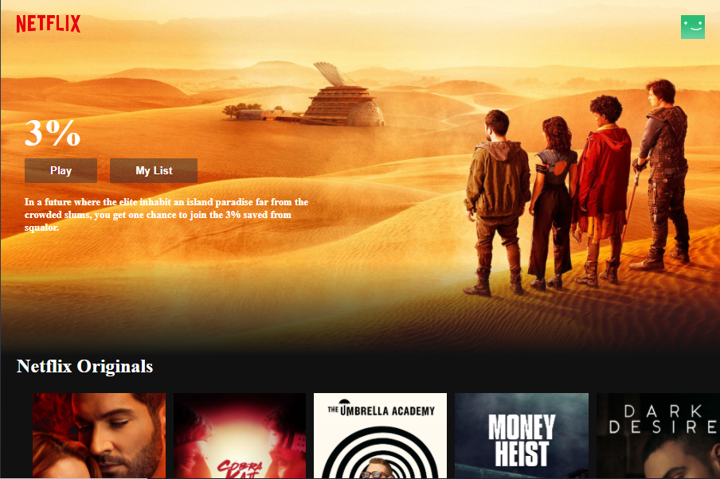

# Netflix Clone

#### Checkout Live Demo of this Netflix's clone: [*Live Site*](https://netflix-clone-f2d12.web.app/)

### Description

A single page React App, have used TMDB API to fetch all the featured movies to the page, also has the functionality to whenever you click on image of the movie, you get the trailer playing if its availabe on youtube and able to fetch. That's cool. It happens by installing npm pakages, react-youtube and movie-trailer. Also nicely added the scroll bar effect. 

> This project was bootstrapped with [Create React App](https://github.com/facebook/create-react-app).
